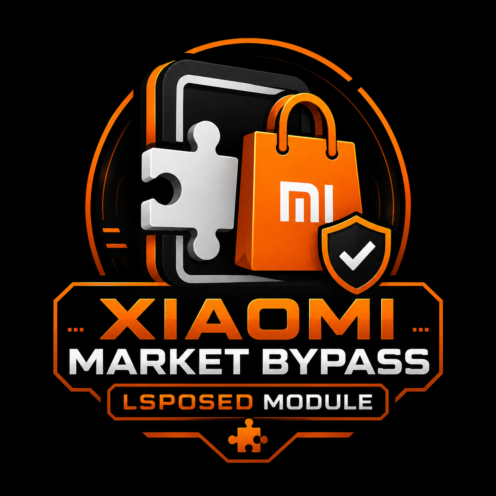

  

  
  

  
  

# Xiaomi Market Bypass

LSPosed module for running Xiaomi Market on AOSP/crDroid ROMs.

The module targets `com.xiaomi.market` and patches the compatibility gaps that make recent Xiaomi Market builds misbehave outside MIUI/HyperOS. It was developed and tested on Xiaomi Redmi Note 13 4G (`sapphire`) running crDroid Android 16.

## What it fixes

- Missing MIUI framework classes and methods used by Xiaomi Market.
- Xiaomi Market identity/storage compatibility checks that crash or block flows on AOSP.
- Blocked `Settings.Secure` writes that are not valid for a normal third-party app.
- PackageInstaller confirmation started from the background on modern Android.
- Stuck installs after a committed install session when the Market UI was backgrounded.

## Tested behavior

The current build was validated with Xiaomi Market **v4.111.0** (recommended version) downloading and installing TikTok Lite/Douyin Lite. The failing path was:

1. Xiaomi Market finished the download.
2. Android blocked the install confirmation activity because Market was in the background.
3. Market stayed stuck at 100% / installing.

The module now defers the pending PackageInstaller intent until Market returns to the foreground, retries the committed-but-uninstalled task, and lets Market receive the normal install-finished callback.

## Requirements

- Android with LSPosed.
- Xiaomi Market installed as `com.xiaomi.market` (v4.111.0 recommended).
- Enable this module for both `com.xiaomi.market` and `com.android.providers.downloads` in LSPosed, then force stop the Market and DownloadProvider or reboot before testing.

The second scope is required for pause and resume because the AOSP DownloadProvider on this ROM does not schedule a paused download again when Xiaomi Market resumes it.

## Download

### 💖 Support My Work

  
  
    
  
  
   
  <code>5198a8b3-6b89-4475-aec1-5adcfcfd12cf</code>
    
  
   
  <code>1GkpDZDHYov7WZLs54Nv19f2KUoZPcACs2</code>
   
  
    
  
   
  <code>45YtYmxUeXeFdokKPG1KWtMFLByS8nwmtiJjEiZ9LfbkNaSUCvyWWAx3VmtDKKkxPJFdQLSXxodRWMt7EBu5TmA3Qi9dgwT</code>
   
  

